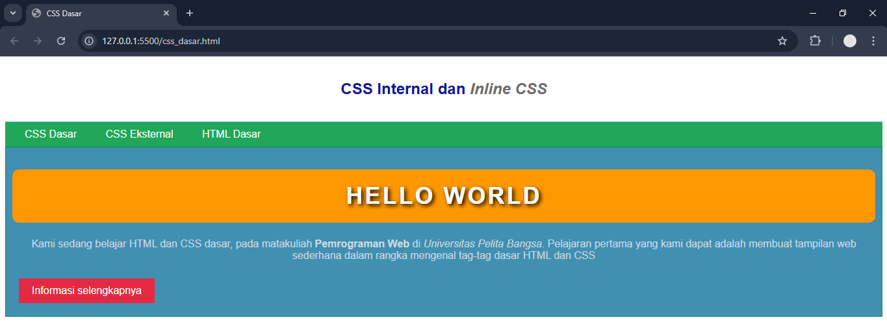

# Tugas Pemrograman Web Pertemuan 3
### 1. Lakukan eksperimen dengan mengubah dan menambah properti dan nilai pada kode CSS dengan mengacu pada CSS Cheat Sheet yang diberikan pada file terpisah dari modul ini.

gambar 1.1 sebelum menambah kode CSS

 

gambar 1.2 sesudah menambah kode CSS

 

### 2. Apa perbedaan pendeklarasian CSS elemen `h1` `{...}` dengan `#intro` `h1` `{...}`? berikan penjelasannya!
`h1 {...}`, disebut type selector. Berlaku untuk semua tag `<h1>` di seluruh dokumen HTML.

 

`intro h1 {...}`, disebut descendant selector, artinya hanya `<h1>` yang berada di dalam elemen dengan ID intro yang kena aturan ini.

Jadi, `<h1>Hello World</h1>` yang ada di dalam `
...
` akan berwarna putih, bukan biru.

 

### 3. Apabila ada deklarasi CSS secara internal, lalu ditambahkan CSS eksternal dan inline CSS pada elemen yang sama. Deklarasi manakah yang akan ditampilkan pada browser? Berikan penjelasan dan contohnya!

Jika semua dipakai pada elemen yang sama:  

A. Inline CSS → prioritas tertinggi.  
   (ditulis langsung di atribut `style=""` pada elemen HTML).

B. Internal CSS → prioritas di bawah inline  
   (ditulis di `<style>` di dalam file HTML).

C. Eksternal CSS → prioritas paling rendah  
   (ditulis di file `.css` yang di-link).

Eksternal (`style_eksternal.css`) misalnya mendefinisikan `h1 { color: blue; }`.  
Internal mendefinisikan `h1 { color: green; }`.  
Inline mendefinisikan `style="color:red;"`.  
 

Hasil di browser = merah, karena inline CSS selalu meng-override yang lain.  

 

### 4. Pada sebuah elemen HTML terdapat ID dan Class, apabila masing-masing selector tersebut terdapat deklarasi CSS, maka deklarasi manakah yang akan ditampilkan pada browser? Berikan penjelasan dan contohnya! ( `
` )

Jika elemen memiliki ID dan Class sekaligus, maka ID lebih kuat dibanding class, sehingga gaya CSS dari ID yang akan tampil.
